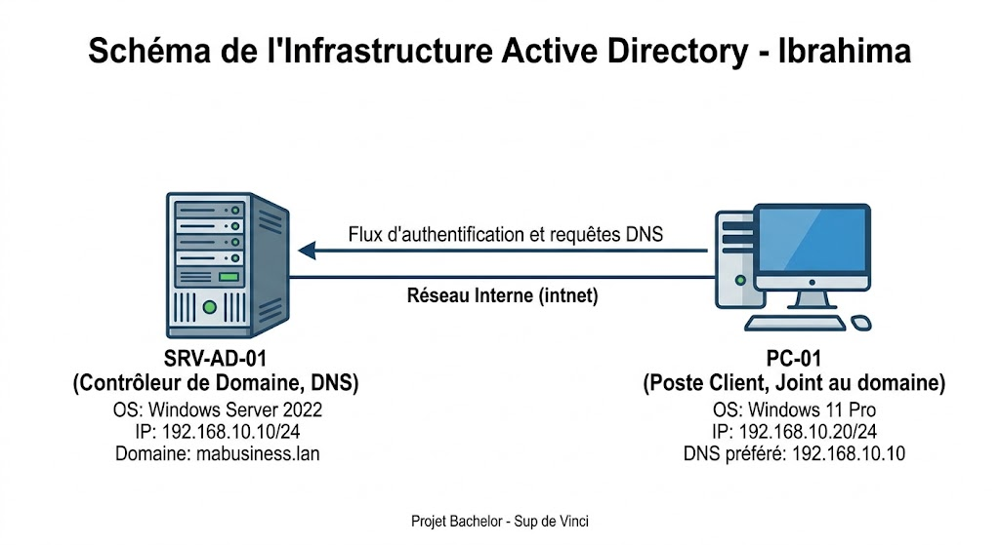
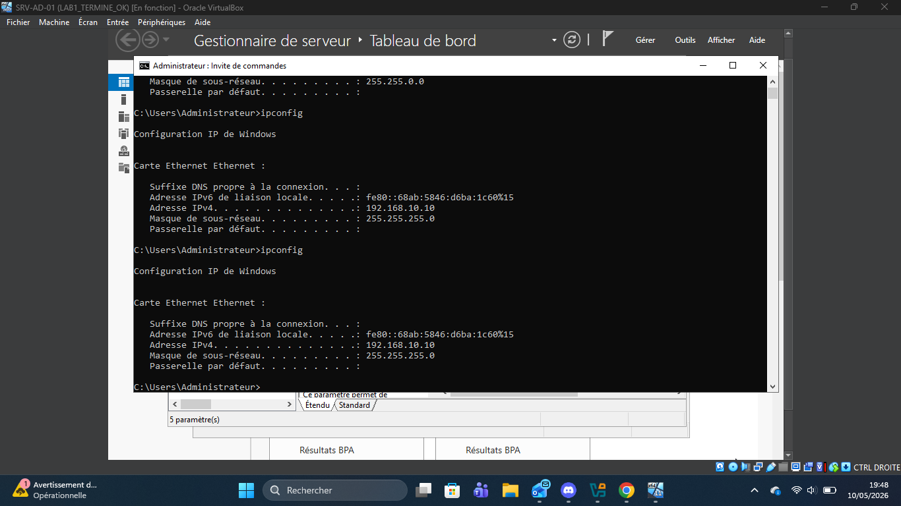
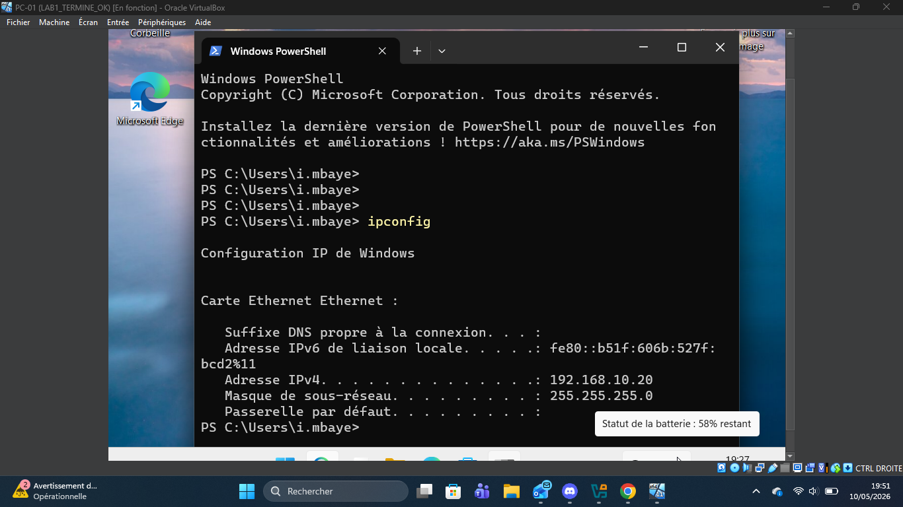
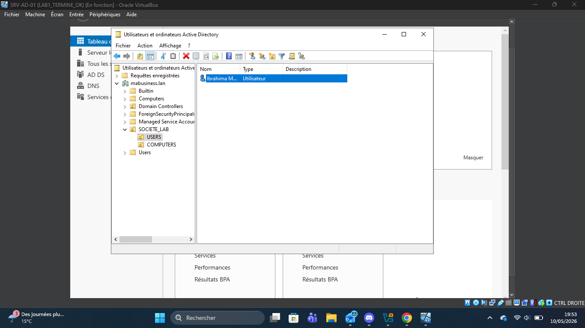
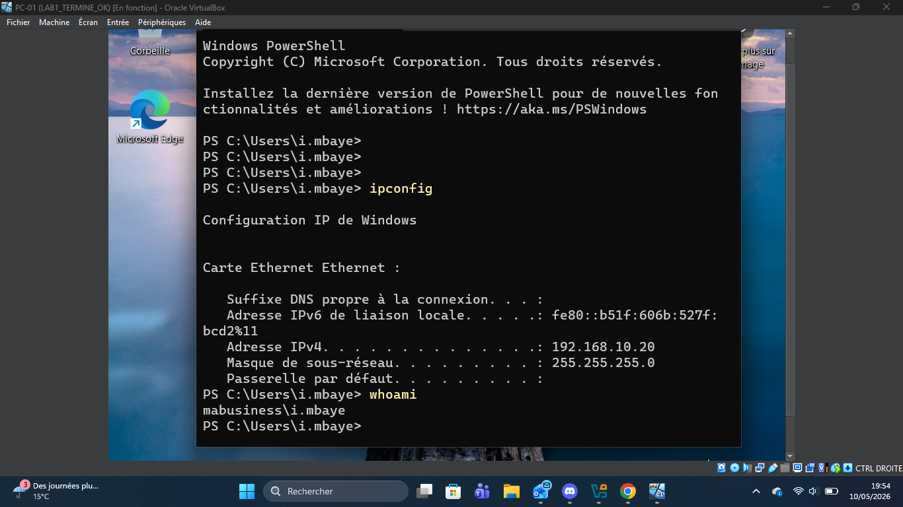
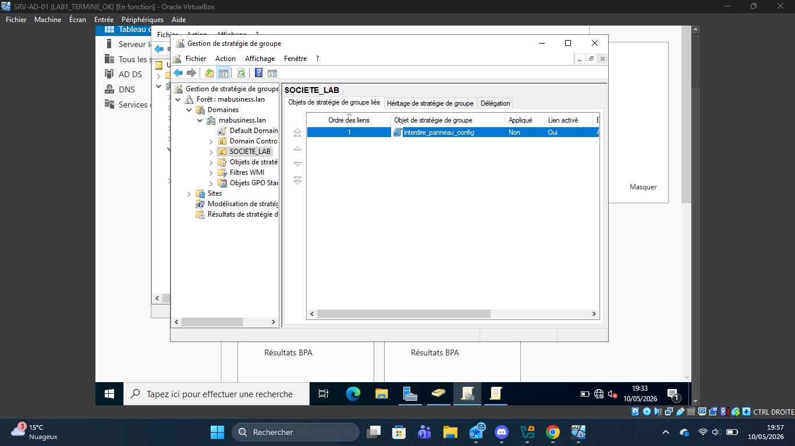
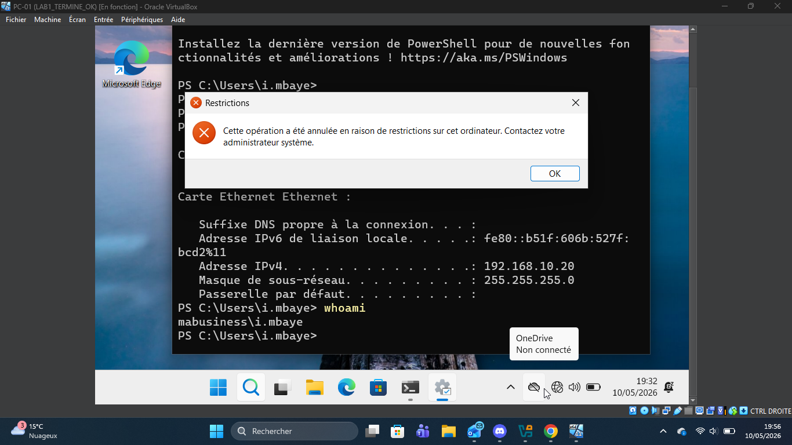

# 🛡️ Labo Active Directory : Déploiement, IAM et Sécurisation (Server 2022 / Windows 11)

## 📌 Présentation du Projet

Ce projet documente la mise en place complète d'un environnement de laboratoire Active Directory Domain Services (AD DS) fonctionnel et isolé sous VirtualBox. L'objectif est de simuler une infrastructure d'entreprise réelle pour valider des compétences clés en administration systèmes, gestion des identités (IAM) et déploiement de politiques de sécurité (GPO).

Ce labo m'a permis de valider des compétences fondamentales nécessaires pour mon cursus Bachelor chez **Sup de Vinci**.

**Compétences clés validées :**
* **Virtualisation :** Déploiement et isolation d'environnements (VirtualBox).
* **Réseau :** Adressage IP statique, configuration DNS interne, dépannage réseau et firewall.
* **IAM (Identity & Access Management) :** Promotion d'un contrôleur de domaine, organisation en Unités d'Organisation (OU).
* **Sécurisation :** Durcissement du poste client via les Stratégies de Groupe (GPO).

---

## 🏗️ Architecture du Labo

L'infrastructure est composée de deux machines virtuelles fonctionnant en **Réseau Interne** (isolées pour simuler un circuit fermé sécurisé).

### Schéma Technique de l'Infrastructure

### Spécifications Techniques :

| Machine | Rôle | OS | Nom d'Hôte | Adresse IP | DNS |
| :--- | :--- | :--- | :--- | :--- | :--- |
| **Serveur AD** | Contrôleur de Domaine (DC), DNS | Windows Server 2022 | `SRV-AD-01` | `192.168.10.10` | `127.0.0.1` |
| **Client** | Poste de travail membre | Windows 11 Pro | `PC-01` | `192.168.10.20` | `192.168.10.10` |

* **Nom de Domaine de la Forêt :** `mabusiness.lan`

---

## 🛠️ Étapes de Mise en Œuvre et Preuves de Concept (PoC)

### Étape 1 : Fondations Réseau et Résolution DNS

* **Configuration IP sur le Serveur :**
  

* **Configuration IP sur le Client :**
  

### Étape 2 : Gestion des Identités (IAM)

* **Vue de l'arborescence Active Directory :**
  

### Étape 3 : Jonction au Domaine et Session Utilisateur

* **Preuve de connexion au domaine (`whoami`) :**
  

### Étape 4 : Sécurisation par GPO

* **Configuration de la GPO :**
  

* **Résultat sur le poste client (Accès bloqué) :**
  

---

## 🔚 Conclusion

Ce laboratoire démontre ma capacité à déployer et administrer une infrastructure Client/Serveur Microsoft. C'est une base solide pour l'administration avancée de parc informatique.
